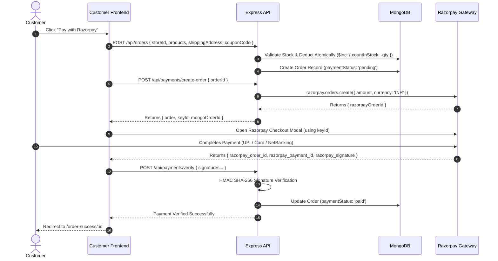

# Zaalima Multi-Tenant E-Commerce Platform

<div align="center">


**An enterprise-ready, multi-tenant marketplace platform featuring decoupled customer shopping, merchant store administration, and a centralized Super Admin control center.**

</div>

---

## 📑 Table of Contents
1. [System Architecture](#-system-architecture)
   - [Architectural Overview](#architectural-overview)
   - [Multi-Tenant Data Isolation Model](#multi-tenant-data-isolation-model)
   - [Component Tier Breakdown](#component-tier-breakdown)
2. [Key Core Workflows & Lifecycles](#-key-core-workflows--lifecycles)
   - [1. Order Checkout & Atomic Inventory Deduction](#1-order-checkout--atomic-inventory-deduction)
   - [2. Multi-Tenant Cart Isolation Engine](#2-multi-tenant-cart-isolation-engine)
   - [3. Merchant Coupon Creation & Dynamic Redemption](#3-merchant-coupon-creation--dynamic-redemption)
   - [4. Super Admin Store Moderation & Suspension](#4-super-admin-store-moderation--suspension)
3. [Database Schema & Data Models](#-database-schema--data-models)
4. [Comprehensive REST API Reference](#-comprehensive-rest-api-reference)
5. [Getting Started & Local Setup](#-getting-started--local-setup)
   - [Prerequisites](#prerequisites)
   - [Environment Configuration](#environment-configuration)
   - [Super Admin Seeding](#super-admin-seeding)
   - [Running the Services](#running-the-services)
6. [Platform Access & Role Matrix](#-platform-access--role-matrix)
7. [Security & Protection Mechanisms](#-security--protection-mechanisms)
8. [License](#-license)

---

## 🏗️ System Architecture

### Architectural Overview

Zaalima is engineered using a **Decoupled 3-Tier Multi-Tenant Architecture**. Rather than deploying separate backend instances per merchant, the platform uses a high-performance **Shared Application, Shared Database with Row-Level Tenant Isolation** model:

```
                                  ┌────────────────────────────────┐
                                  │      CLIENT APPLICATION TIER   │
                                  └────────────────────────────────┘
                 ┌─────────────────────────────────┼────────────────────────────────┐
                 │                                 │                                │
                 ▼                                 ▼                                ▼
     ┌───────────────────────┐         ┌───────────────────────┐        ┌───────────────────────┐
     │ Customer Marketplace  │         │ Merchant Vendor Hub   │        │   Super Admin Suite   │
     │  (Port 5173 / React)  │         │  (Port 5174 / React)  │        │ (Port 5174 /admin/*)  │
     └───────────┬───────────┘         └───────────┬───────────┘        └───────────┬───────────┘
                 │                                 │                                │
                 └─────────────────────────────────┼────────────────────────────────┘
                                                   │ HTTPS / REST API / Bearer JWT
                                                   ▼
     ┌──────────────────────────────────────────────────────────────────────────────────────────┐
     │                             EXPRESS.JS REST API GATEWAY (Port 5000)                      │
     │  ┌────────────────────┐   ┌───────────────────────────┐   ┌───────────────────────────┐  │
     │  │  CORS & Rate Limits│   │ JWT Auth & RBAC Middleware│   │  Tenant Context Resolver  │  │
     │  └────────────────────┘   └───────────────────────────┘   └───────────────────────────┘  │
     └─────────────────────────────────────────────┬────────────────────────────────────────────┘
                                                   │
     ┌─────────────────────────────────────────────┼────────────────────────────────────────────┐
     │                                      DOMAIN SERVICES                                     │
     │  ┌──────────────┐   ┌──────────────┐   ┌──────────────┐   ┌──────────────┐   ┌────────┐  │
     │  │Store Service │   │Product & Inv │   │Order Service │   │Coupon Engine │   │ Admin  │  │
     │  └──────┬───────┘   └──────┬───────┘   └──────┬───────┘   └──────┬───────┘   └───┬────┘  │
     └─────────┼──────────────────┼──────────────────┼──────────────────┼───────────────┼───────┘
               │                  │                  │                  │               │
               ▼                  ▼                  ▼                  ▼               ▼
     ┌──────────────────────────────────────────────────────────────────────────────────────────┐
     │                                   PERSISTENCE & EXTERNAL                                 │
     │   ┌─────────────────────────────────────────┐      ┌─────────────────────────────────┐   │
     │   │          MongoDB (Mongoose ODM)         │      │        Third-Party Services     │   │
     │   │  • Users (Customer / Vendor / Admin)    │      │  • Razorpay (Payments & Webhook)│   │
     │   │  • Stores (Tenant Profile & Status)     │      │  • Cloudinary (Media CDN)       │   │
     │   │  • Products & Categories (Tenant Scoped)│      │  • Nodemailer / SMTP (Emails)   │   │
     │   │  • Orders (Isolated Line Items)         │      └─────────────────────────────────┘   │
     │   │  • Coupons (Tenant Code & Redemptions)  │                                            │
     │   └─────────────────────────────────────────┘                                            │
     └──────────────────────────────────────────────────────────────────────────────────────────┘
```

---

### Multi-Tenant Data Isolation Model

1. **Logical Tenant Boundaries**:
   - Every resource that belongs to a merchant (`Product`, `Category`, `Order`, `Coupon`) stores an indexed `storeId: { type: ObjectId, ref: 'Store', index: true }`.
2. **Access Control Enforcement**:
   - When a vendor requests or mutates a resource, controllers verify tenant ownership using `ownerId: req.user._id`.
   - A vendor can never query, mutate, or fulfill products or orders belonging to another merchant.
3. **Public Discovery Guard**:
   - Customer-facing queries enforce `{ isActive: true }` on stores. If a store is suspended by the Super Admin, all products from that store are automatically excluded from marketplace discovery and direct access.

---

### Component Tier Breakdown

| Component Workspace | Technologies | Port | Primary Responsibilities |
| :--- | :--- | :--- | :--- |
| **`backend/`** | Node.js, Express, Mongoose, JWT, Razorpay SDK, Cloudinary | `5000` | REST API, role enforcement, atomic transactions, payment verification, coupon validation. |
| **`customer-side-frontend/`** | React 19, Vite, Redux Toolkit, Tailwind CSS, Lucide | `5173` | Store catalog discovery, real-time live search, single-store cart isolation, Razorpay checkout. |
| **`frontend-vendor/`** | React 19, Vite, Tailwind CSS, Axios Interceptors | `5174` | **Dual-Portal Client**: Merchant store administration and isolated `/admin/*` Super Admin suite. |

---

## 🔄 Key Core Workflows & Lifecycles

### 1. Order Checkout & Atomic Inventory Deduction



- **Stock Reservation**: Inventory is verified and decremented before payment initiation. If validation fails, an error is returned before any charge occurs.
- **Rollback Resilience**: In case of signature forgery or checkout failure, stock is restored cleanly.

---

### 2. Multi-Tenant Cart Isolation Engine

In a multi-tenant platform, fulfillment from different stores cannot be merged into a single logistics order.
- When an item is added to cart via `cartSlice.js`, the store identifier of the item is checked against existing cart items.
- If a customer attempts to add an item from **Store B** while cart contains items from **Store A**:
  - The client triggers an explicit prompt: *"Your cart contains items from [Previous Store]. Clear cart to add items from [New Store]?"*
  - This prevents cross-tenant checkout corruption at the boundary level.

---

### 3. Merchant Coupon Creation & Dynamic Redemption

```
[Merchant Dashboard] ──> Creates Coupon (Code: 'FESTIVE20', Discount: 20%, Expiry, Max Uses)
                               │
                               ▼ Saved in MongoDB under storeId
[Customer Checkout]   ──> Applies 'FESTIVE20'
                               │
                               ▼ POST /api/coupons/validate { storeId, code }
                      Validates:
                      1. Coupon belongs to active store
                      2. Expiry date > now()
                      3. currentUses < maxUses
                      4. isActive === true
                               │
                               ▼ Discount applied in Redux state & subtracted from final total
```

---

### 4. Super Admin Store Moderation & Suspension

- **Platform-Wide Store Registry**: Super Admin audits all registered stores with owner details, slug, and creation timestamp.
- **1-Click Moderation**:
  - Clicking **Suspend Store** triggers `PUT /api/admin/stores/:id/status`.
  - The store's `isActive` flag is toggled to `false`.
  - The store and its entire product catalog immediately disappear from public search, category filters, and store landing pages on `customer-side-frontend`.
  - Clicking **Activate Store** restores visibility across the marketplace.

---

## 🗄️ Database Schema & Data Models

| Model | Key Fields | Relationships | Notes |
| :--- | :--- | :--- | :--- |
| **`User`** | `name`, `email`, `password`, `role` | 1-to-1 with `Store` (if vendor) | Roles: `customer`, `vendor`, `super_admin`. |
| **`Store`** | `name`, `slug`, `description`, `logoUrl`, `isActive`, `ownerId` | `ownerId` -> `User` | Unique `slug` used for store routes (e.g. `/stores/:slug`). |
| **`Product`** | `name`, `description`, `price`, `countInStock`, `images`, `category`, `storeId` | `storeId` -> `Store` | Scoped to individual merchant store. |
| **`Category`**| `name`, `slug`, `storeId` | `storeId` -> `Store` | Publicly consumable dropdown for vendor categorization. |
| **`Order`** | `customerId`, `storeId`, `products`, `totalAmount`, `paymentStatus`, `orderStatus`, `razorpayOrderId` | `customerId` -> `User`, `storeId` -> `Store` | `paymentStatus`: `pending`, `paid`, `failed`. `orderStatus`: `processing`, `shipped`, `delivered`, `cancelled`. |
| **`Coupon`** | `code`, `discountPercentage`, `maxUses`, `usedCount`, `expiryDate`, `isActive`, `storeId` | `storeId` -> `Store` | Store-scoped discount voucher. |

---

## 🔌 Comprehensive REST API Reference

### 🔐 Authentication (`/api/auth`)
- `POST /api/auth/register` — Register a customer or merchant vendor.
- `POST /api/auth/login` — Login with credentials; returns JWT token & user role.
- `GET /api/auth/profile` — Get authenticated user's profile `[Private]`.

### 🏪 Store Management (`/api/stores`)
- `GET /api/stores` — Browse all active marketplace stores `[Public]`.
- `GET /api/stores/:slug` — View single store details by slug identifier `[Public]`.
- `POST /api/stores` — Create a new merchant store `[Vendor / Admin]`.
- `GET /api/stores/my-store` — Retrieve current vendor's store profile `[Vendor / Admin]`.
- `PUT /api/stores/:id` — Update store details & branding `[Vendor / Admin]`.

### 📦 Products & Categories (`/api/products`, `/api/categories`)
- `GET /api/products` — Browse products with search & category filtering `[Public]`.
- `GET /api/products/:id` — Single product details with live stock availability `[Public]`.
- `POST /api/products` — Create new product under vendor's store `[Vendor / Admin]`.
- `PUT /api/products/:id` — Update product details, stock, or price `[Vendor / Admin]`.
- `DELETE /api/products/:id` — Delete product listing `[Vendor / Admin]`.
- `GET /api/categories/public/:storeId` — Public categories for a specific store `[Public]`.

### 🛒 Orders & Fulfillment (`/api/orders`)
- `POST /api/orders` — Create order with atomic stock deduction & coupon calculation `[Customer]`.
- `GET /api/orders` — Customer's historical orders log `[Customer]`.
- `GET /api/orders/:id` — Order details and itemized receipt `[Private]`.
- `GET /api/orders/store/:storeId` — Vendor's store-specific orders `[Vendor / Admin]`.
- `PUT /api/orders/:id/status` — Advance order fulfillment lifecycle status `[Vendor / Admin]`.
- `GET /api/orders/analytics/my-store` — 7-day revenue trend & status breakdown `[Vendor / Admin]`.

### 🎟️ Coupons (`/api/coupons`)
- `POST /api/coupons` — Create coupon with discount %, expiry, and usage limits `[Vendor / Admin]`.
- `GET /api/coupons/my-store` — Retrieve all active and expired store coupons `[Vendor / Admin]`.
- `DELETE /api/coupons/:id` — Delete coupon `[Vendor / Admin]`.
- `PATCH /api/coupons/:id/toggle` — Toggle coupon active status `[Vendor / Admin]`.
- `POST /api/coupons/validate` — Validate coupon code against store and cart total `[Public / Customer]`.

### 💳 Payments (`/api/payments`)
- `POST /api/payments/create-order` — Create Razorpay order and return `keyId` `[Customer]`.
- `POST /api/payments/verify` — Verify HMAC SHA-256 payment signature and mark order paid `[Customer]`.
- `POST /api/payments/webhook` — Razorpay webhook listener for asynchronous event capture `[Public]`.

### 🛡️ Super Admin Suite (`/api/admin`)
- `GET /api/admin/analytics` — Platform-wide metrics: Total Users, Vendors, Stores, Orders, Gross Revenue `[Super Admin]`.
- `GET /api/admin/stores` — Full directory of stores with merchant owner information `[Super Admin]`.
- `PUT /api/admin/stores/:storeId/status` — 1-click Activate / Suspend store toggle `[Super Admin]`.
- `GET /api/admin/users` — Cross-platform user registry with search & role filters `[Super Admin]`.
- `GET /api/admin/orders` — Global real-time orders stream across all marketplace stores `[Super Admin]`.

---

## 🚀 Getting Started & Local Setup

### Prerequisites
- **Node.js**: `v18.0.0` or higher
- **MongoDB**: MongoDB Atlas URI or Local MongoDB instance running on port `27017`
- **Razorpay Account**: Razorpay Dashboard Test Key ID & Secret
- **Cloudinary Account**: Cloudinary Cloud Name, API Key, and Secret

---

### Environment Configuration

#### 1. Backend (`backend/.env`)
Create `backend/.env` using the following configuration template:

```env
PORT=5000
NODE_ENV=development
MONGO_URI=your_mongodb_connection_string

# Authentication
JWT_SECRET=your_jwt_secret_key_min_32_chars

# Super Admin Account Initializer (Seeder)
ADMIN_NAME="Platform Super Admin"
ADMIN_EMAIL=admin@zaalima.com
ADMIN_PASSWORD=YourSecurePassword123!

# Razorpay Payment Gateway
RAZORPAY_KEY_ID=rzp_test_your_key_id
RAZORPAY_KEY_SECRET=your_razorpay_key_secret
RAZORPAY_WEBHOOK_SECRET=your_optional_webhook_secret

# Cloudinary Storage
CLOUDINARY_CLOUD_NAME=your_cloudinary_name
CLOUDINARY_API_KEY=your_cloudinary_key
CLOUDINARY_API_SECRET=your_cloudinary_secret

# Transactional Email (Optional / Gmail SMTP or Resend)
EMAIL_HOST=smtp.gmail.com
EMAIL_PORT=587
EMAIL_USER=your_email@gmail.com
EMAIL_PASSWORD=your_app_password
EMAIL_FROM=your_email@gmail.com
```

#### 2. Customer Marketplace (`customer-side-frontend/.env`)
```env
VITE_RAZORPAY_KEY_ID=rzp_test_your_key_id
```

---

### Super Admin Seeding
To initialize the Super Admin account in MongoDB using your `.env` credentials, execute:

```bash
cd backend
node seeder.js
```

---

### Running the Services

Open three terminal windows to launch the decoupled workspaces:

```bash
# Terminal 1: Backend API
cd backend
npm install
npm run dev
# ➜ Running on http://localhost:5000

# Terminal 2: Customer Marketplace Frontend
cd customer-side-frontend
npm install
npm run dev
# ➜ Running on http://localhost:5173

# Terminal 3: Vendor Portal & Super Admin Frontend
cd frontend-vendor
npm install
npm run dev
# ➜ Running on http://localhost:5174
```

---

## 🧭 Platform Access & Role Matrix

| Portal View | URL Route | Access Level | Description |
| :--- | :--- | :--- | :--- |
| **Marketplace Storefront** | `http://localhost:5173/` | Public | Browse stores, search products, add to cart, and checkout. |
| **Merchant / Admin Login** | `http://localhost:5174/login` | Merchant / Admin | Unified authentication portal; auto-redirects based on role. |
| **Vendor Dashboard** | `http://localhost:5174/dashboard` | `vendor` | Store catalog, product additions, orders, and coupons. |
| **Super Admin Overview** | `http://localhost:5174/admin/dashboard` | `super_admin` | Platform gross revenue, active/suspended store ratio, global orders. |
| **Store Moderation** | `http://localhost:5174/admin/stores` | `super_admin` | Audit merchant stores and toggle 1-click activation/suspension. |
| **Users Directory** | `http://localhost:5174/admin/users` | `super_admin` | Filter accounts by Customer, Vendor, and Super Admin. |
| **Global Orders Oversight** | `http://localhost:5174/admin/orders` | `super_admin` | Inspect all orders across all marketplace stores. |

---

## 🛡️ Security & Protection Mechanisms

1. **Strict Role-Based Routing (RBAC)**:
   - `AdminProtectedRoute.jsx` intercepts requests to `/admin/*`. Non-admin accounts attempting access are rejected and redirected.
   - `ProtectedRoute.jsx` ensures customer tokens cannot access merchant dashboard operations.
2. **Key Transmission Security**:
   - The backend `/payments/create-order` endpoint dynamically supplies the public `keyId` to the client, preventing key mismatches while keeping `RAZORPAY_KEY_SECRET` strictly on the server.
3. **Cryptographic Webhook & Signature Verification**:
   - Razorpay payment success is verified using `crypto.createHmac('sha256', secret)` to protect against spoofed checkout confirmations.
4. **Optimistic UI with Failure Rollbacks**:
   - Store moderation status changes update the UI optimistically for instant feedback, automatically reverting if the backend request fails.

---

## 📜 License
This project is licensed under the **ISC License**. Designed and developed for the Zaalima Multi-Tenant Marketplace Platform.
